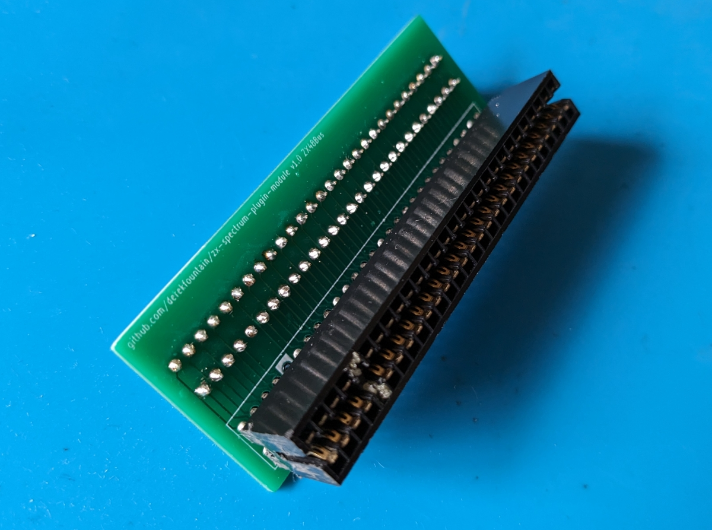

# ZX Spectrum Plugin Module

This is small interposer board I created for the ZX Spectrum's edge connector.

## Improved edge connector

The Spectrum's edge connector can be rather tight, and repeated
insertion and removal of an interface you're prototyping can wear it
away. The copper pads are difficult to repair if they wear too thin
and stop working. Also, the edge connector sockets need cutting to
size and a locating pin inserting, which is all a bit fiddly and so
they are relatively expensive.

The interposer board converts the Spectrum's edge connector hardware
format to a much more standard row of 2.54" header pins. It looks like
this:

Front:

Back:

So you solder a Spectrum edge connector to the front:

and a couple of rows of standard header sockets to the back:

The board you're prototyping can then use standard header pins
in place the normal Spectrum edge connector socket:

This allows you to plug the prototype into the interposer, as opposed
to the Spectrum's edge connector:

So now the prototype can be put onto, and pulled off, the Spectrum
without wearing the edge connector, and each prototype iteration costs
you 2 rows of standard header pins instead of an edge connector
socket.

## Another use

A rather unintended alternative use for the board is to expose the
edge connector pins more easily. It's a lot easier to insert a wire
into a header socket and connect the other end to the oscilloscope
probe than it is to try to get the probe on a certain Z80 pin, for
example.

To this end I ended up making a "breakout" version as well, which also
exposes the edge connector's signals on connection points. I'm not
sure this version is useful, since I think the prototype board and the
back of the Spectrum will foul access to the extra test points. I
didn't pursue it, but it might be useful to someone.

### Construction

Construction is trivial, but try to use long strip of sockets cut
down, as opposed to what I did which was use a strip of 20 butted up
against a strip of 8. It turns out the sides of the strips are
slightly thicker plastic then that between the connection points, so
when you butt them up together you get a wider gap between the
individual points at the joint. It's very slight, just a fraction of a
millimetre, but it makes fitting the header pins into the sockets a
bit tighter than it needs to be.

### Licence

Released under the GPL, which might not mean much to a hardware
design. If you make any useful modifications to it, stick to the
spirit and release them. :)

[Derek Fountain](https://www.derekfountain.org/), September 2023

